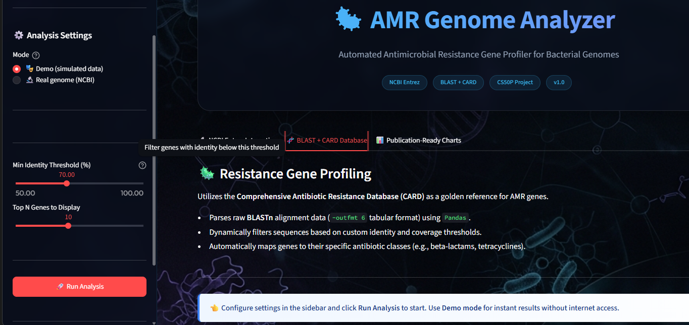
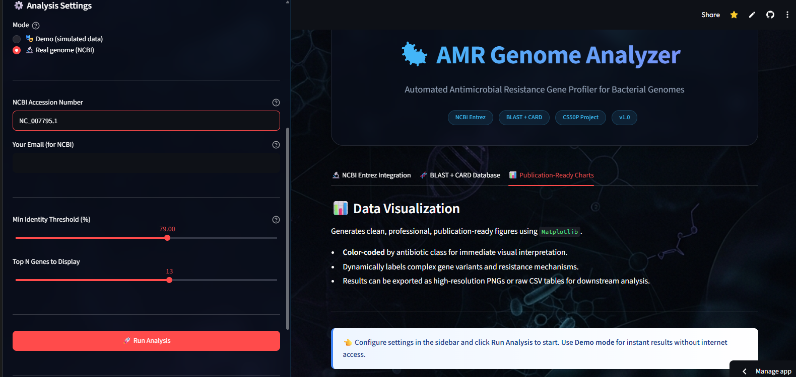
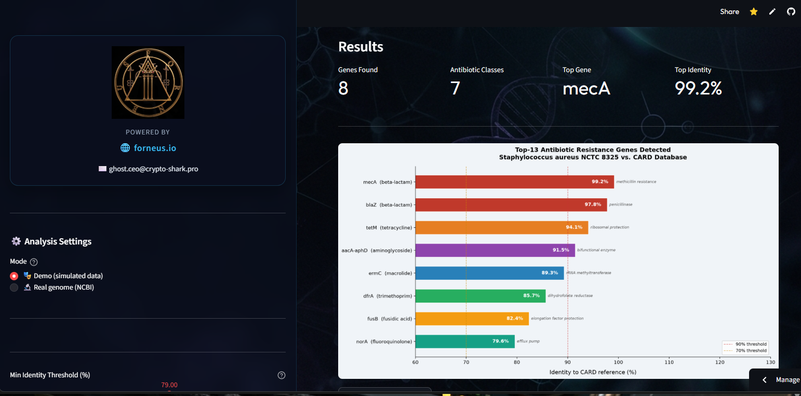
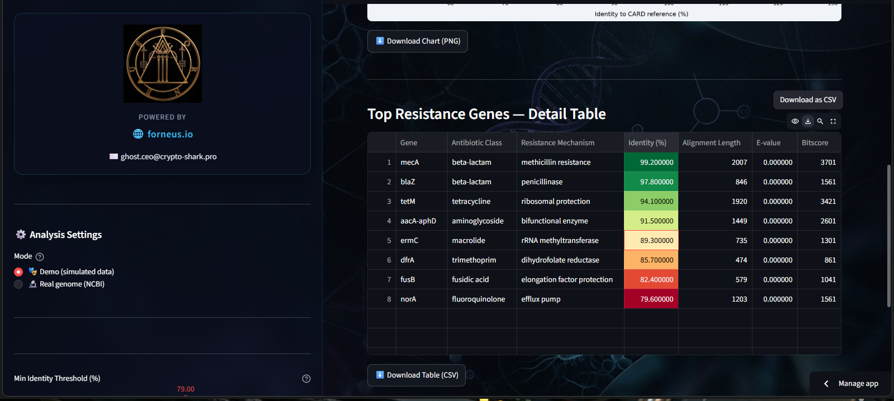
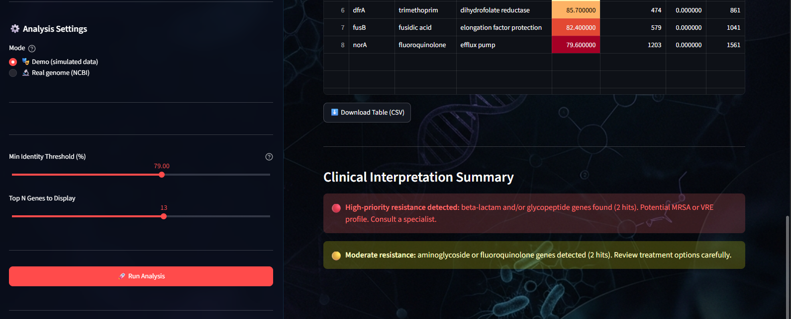

# 🦠 AMR Genome Analyzer

> **Automated Antimicrobial Resistance Profiler for Bacterial Genomes**  
> Professional Bioinformatics Pipeline developed for **Forneus Technologies**

**🌟 Live Demo:** [AMR Genome Analyzer on Streamlit](https://amr-genome-analyzer.streamlit.app/)

---

## 📸 Dashboard & Interface

### 🧬 Professional Web Interface

*A sleek, glassmorphism-inspired UI designed for enterprise bioinformatics.*

### 📊 Comprehensive AMR Dashboard & Overview

*Automated detection of resistance mechanisms and key genomic metrics.*

### 📈 Analytics & First Results Table

*High-level summary of the most critical resistance findings.*

### 📋 Detailed Resistance Genes Table

*Granular data view showing exact gene locations, identities, and resistance mechanisms.*

### 💡 Clinical Interpretation

*Clear, actionable summaries for immediate medical or research decision-making.*

---

## 📌 Description

**AMR Genome Analyzer** is a Python command-line tool that automates the detection of antimicrobial resistance (AMR) genes in bacterial genomes. It integrates with the **NCBI Entrez** API to fetch GenBank records, parses standard **BLAST tabular output** (.tsv) filtered against the **CARD** (Comprehensive Antibiotic Resistance Database), and produces a professional, publication-ready visualization.

This tool is designed for:
- **Veterinary microbiologists** needing quick AMR profiling of pathogens (e.g., *Staphylococcus aureus*, *E. coli*)
- **Researchers** performing rapid genomic surveillance
- **Freelance bioinformaticians** delivering AMR reports to clients

---

## ✨ Features

| Feature | Description |
|---------|-------------|
| 🔬 **NCBI Entrez Integration** | Auto-downloads bacterial genomes by accession number (GenBank format) |
| 🧬 **BLAST Result Parsing** | Reads standard `-outfmt 6` TSV output, filters by identity threshold |
| 📊 **Smart Visualization** | Horizontal bar chart colored by antibiotic class with mechanism labels |
| 🎭 **Demo Mode** | Runs without internet/BLAST using realistic simulated *S. aureus* data |
| 🧪 **Full Test Coverage** | 10 pytest tests covering all core functions and edge cases |
| ⚙️ **Flexible CLI** | `argparse`-based interface with `--demo`, `--accession`, `--identity`, `--top` flags |

---

## 🚀 Quick Start

### 1. Clone and install

```bash
git clone https://github.com/YOUR_USERNAME/amr-genome-analyzer.git
cd amr-genome-analyzer
pip install -r requirements.txt
```

### 2. Configure your email (required for NCBI)

```bash
cp .env.example .env
# Open .env and replace with your real email:
# NCBI_EMAIL=your_real_email@example.com
```

### 3. Run in demo mode (no internet needed)

```bash
python project.py --demo
```

### 4. Run with a real genome

```bash
# Default genome: Staphylococcus aureus NCTC 8325
python project.py --accession NC_007795.1

# Custom identity threshold and top-15 genes
python project.py --accession NC_007795.1 --identity 80 --top 15
```

### 5. See all options

```bash
python project.py --help
```

---

## 📁 Project Structure

```
amr-genome-analyzer/
├── project.py          # Main program (download → filter → visualize)
├── test_project.py     # pytest unit tests (10 tests)
├── requirements.txt    # Python dependencies
├── .env.example        # Template for environment variables
├── .gitignore          # Excludes .env and cache from Git
├── data/               # Downloaded GenBank genome files (auto-created)
└── results/            # Output charts and BLAST data (auto-created)
    ├── blast_hits.tsv
    └── top_resistance_genes.png
```

---

## 🧪 Running Tests

```bash
pytest test_project.py -v
```

Expected output: **10 passed** covering:
- DataFrame generation and structure validation
- BLAST file filtering and sorting correctness
- Error handling (missing file, empty file)
- Chart file creation and empty-data handling

---

## 📊 Output Example

The tool generates a chart like this:

- Each bar = one resistance gene
- **Color** = antibiotic class (red=beta-lactam, orange=tetracycline, blue=macrolide, etc.)
- **% label** inside bar = identity to CARD reference
- **Italic text** right of bar = resistance mechanism

---

## 🔬 Scientific Background

- **CARD** (Comprehensive Antibiotic Resistance Database) — gold standard reference for AMR genes
- **BLAST** (Basic Local Alignment Search Tool) — sequence similarity search
- **mecA** gene — confers methicillin resistance (MRSA)
- **vanA** gene — glycopeptide (vancomycin) resistance
- **Identity threshold** ≥70% recommended for species-level hits

---

## 💼 Future Development 

- [ ] Streamlit web interface for clinical use
- [ ] Multi-genome batch processing
- [ ] PDF report generation
- [ ] Real-time BLAST API integration (NCBI BLAST+)
- [ ] Species auto-detection from genome metadata

---

## 🛠 Dependencies

| Package | Version | Purpose |
|---------|---------|---------|
| `biopython` | ≥1.81 | NCBI Entrez API, SeqIO parsing |
| `pandas` | ≥2.0.0 | Data manipulation |
| `matplotlib` | ≥3.7.0 | Visualization |
| `python-dotenv` | ≥1.0.0 | Secure environment configuration |
| `pytest` | ≥7.4.0 | Unit testing |

---

## 👤 Author

Built as CS50P final project.  
**Domain:** Veterinary bioinformatics / AMR genomics  
**Platform:** Python 3.11+
